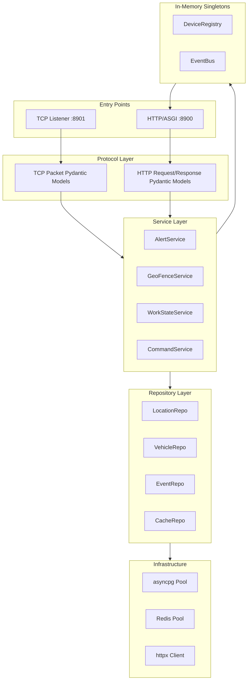
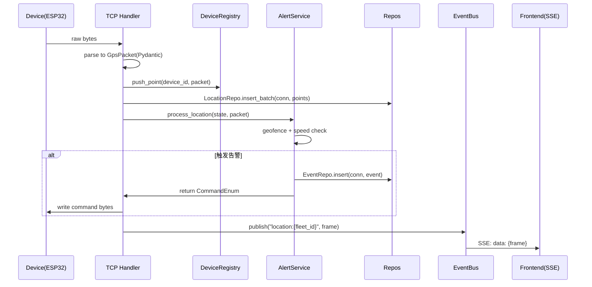
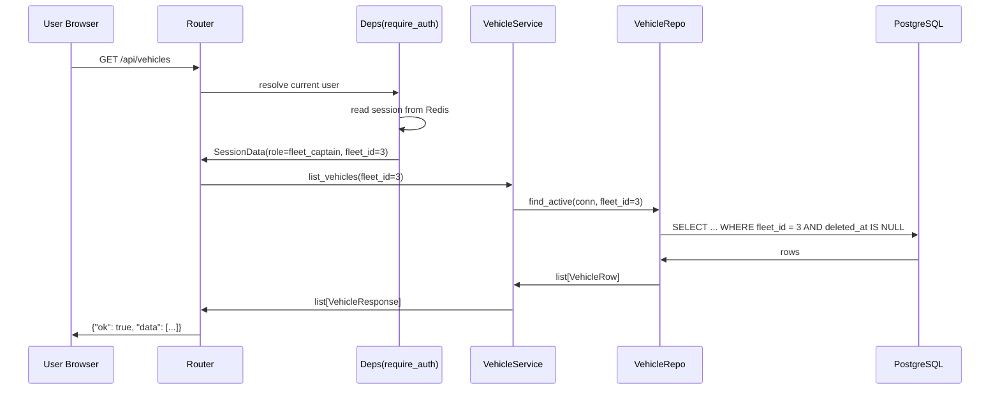

# TMSS 后端架构规范

> **本文档为强制规范**，所有后端代码必须遵守。新增模块、合并 PR 前需对照本文档自检。  
> 适用范围：`tmss-server` Python 后端（FastAPI + asyncio TCP + asyncpg + Redis）。

---

## 目录

1. [分层架构](#1-分层架构)
2. [内存组件](#2-内存组件)
3. [典型数据流](#3-典型数据流)
4. [命名规范](#4-命名规范)
5. [错误处理](#5-错误处理)
6. [异步任务规范](#6-异步任务规范)
7. [数据库访问规范](#7-数据库访问规范)
8. [配置管理](#8-配置管理)
9. [认证与数据隔离](#9-认证与数据隔离)
10. [测试规范](#10-测试规范)
11. [日志规范](#11-日志规范)
12. [项目目录结构](#12-项目目录结构)
13. [代码质量门禁](#13-代码质量门禁)

---

## 1. 分层架构

### 1.1 层次模型



### 1.2 各层职责与禁止事项

| 层 | 必须做 | 禁止做 |
| --- | --- | --- |
| **Entry**（TCP/HTTP 入口） | 解析输入、调用一个 Service 方法、返回结果 | 写业务 `if`/`for`、直接访问数据库、直接构造 SQL |
| **Protocol**（Pydantic 模型） | 定义请求/响应/报文结构，字段校验 | 任何 I/O，导入 service/repo |
| **Service**（业务逻辑） | 编排业务流程、调用 Repository 与内存组件 | 直接 import `asyncpg` / `redis` / `httpx`，写 SQL |
| **Repository**（数据访问） | 执行 SQL、读写 Redis、调用外部 API | 包含业务规则判断（如"超速时下发 ws"），import `app.services` |
| **Infrastructure**（连接池/客户端） | 创建并暴露 `asyncpg.Pool` / `Redis` / `httpx.AsyncClient` | 业务逻辑 |

**核心规则：依赖方向严格自上而下，禁止跨层调用与反向依赖。**

```python
# ✅ 正确：Service 调用 Repository
class AlertService:
    def __init__(self, event_repo: EventRepo, location_repo: LocationRepo):
        self._event_repo = event_repo
        self._location_repo = location_repo

# ❌ 错误：Service 直接用 asyncpg
class AlertService:
    async def fire_alert(self, conn: asyncpg.Connection):
        await conn.execute("INSERT INTO event ...")  # 禁止
```

---

## 2. 内存组件

### 2.1 `DeviceRegistry`（位置：`app/core/device_registry.py`）

**职责**：管理所有当前在线设备的运行时状态，单例。

**字段（每设备一份）**：

```python
@dataclass
class DeviceState:
    device_id: int
    imei: str
    vehicle_id: int | None
    fleet_id: int | None
    writer: asyncio.StreamWriter           # TCP 写入句柄
    last_heartbeat_at: datetime
    recent_points: deque[GpsPacket]        # 最近 300 点缓存（断线重连回放）
    current_work_state: WorkState
    active_zone_ids: set[int]              # 当前所在围栏集合（用于 zone_entry/exit 触发）
    connected_at: datetime
```

**对外 API**（仅允许通过这些方法访问）：

```python
class DeviceRegistry:
    async def register(self, imei: str, writer: StreamWriter) -> DeviceState: ...
    async def unregister(self, device_id: int) -> None: ...
    async def get(self, device_id: int) -> DeviceState | None: ...
    async def get_by_imei(self, imei: str) -> DeviceState | None: ...
    async def list_online(self, fleet_id: int | None = None) -> list[DeviceState]: ...
    async def update_heartbeat(self, device_id: int) -> None: ...
    async def push_point(self, device_id: int, point: GpsPacket) -> None: ...
    async def send_command(self, device_id: int, cmd: bytes) -> bool: ...
```

**禁止**：从外部直接访问 `_devices` 字典或修改 `DeviceState` 字段。

### 2.2 `EventBus`（位置：`app/core/event_bus.py`）

**职责**：进程内 pub/sub，连接 TCP 写入侧与 SSE 推送侧。

**Topic 命名规范**：

| Topic 模式 | 说明 |
| --- | --- |
| `location:{fleet_id}` | 实时定位帧（车队隔离） |
| `location:all` | 管理者订阅全部车辆位置 |
| `alert:{fleet_id}` | 告警事件 |
| `alert:all` | 管理者订阅全部告警 |
| `device_state` | 设备上线/下线状态变更 |

**对外 API**：

```python
class EventBus:
    async def publish(self, topic: str, payload: dict[str, Any]) -> None: ...

    @asynccontextmanager
    async def subscribe(self, topics: list[str]) -> AsyncIterator[asyncio.Queue]:
        """订阅多个 topic，返回有界队列。退出 context 自动取消订阅。"""
```

**约束**：
- 订阅者队列 `maxsize=200`，超出时**丢弃最旧消息**（避免慢消费者拖慢发布者）
- 单条消息必须可 JSON 序列化（dict/list/基础类型），禁止传对象引用

---

## 3. 典型数据流

### 3.1 GPS 报文 → 事件 → SSE 推送



### 3.2 后台 HTTP 查询车辆列表（带数据隔离）



---

## 4. 命名规范

### 4.1 Python 标识符

| 类别 | 规则 | 示例 |
| --- | --- | --- |
| 模块文件 | `snake_case.py` | `geo_fence_service.py` |
| 包目录 | `snake_case` | `app/services/`, `app/db/queries/` |
| 类 | `PascalCase` | `GeoFenceService`, `DeviceState` |
| 函数 / 方法 | `snake_case` | `fire_alert`, `parse_gps_packet` |
| 常量 | `SCREAMING_SNAKE` | `MAX_POINTS_PER_DEVICE = 300` |
| 枚举类 | `PascalCase` 类 + `SCREAMING_SNAKE` 成员 | `WorkState.LOADING` |
| 私有成员 | 前置 `_` | `self._pool`, `_parse_coordinates()` |
| 类型别名 | `PascalCase` | `DeviceId = int` |

### 4.2 Pydantic 模型

| 用途 | 后缀 | 示例 |
| --- | --- | --- |
| HTTP 入参（创建） | `Create` | `VehicleCreate` |
| HTTP 入参（更新） | `Update` | `VehicleUpdate` |
| HTTP 出参（列表项） | `Response` | `VehicleResponse` |
| HTTP 出参（详情） | `Detail` | `VehicleDetail` |
| TCP 报文 | `Packet` | `GpsPacket`, `RegisterPacket` |
| 内部数据传输对象 | `Row` / `Data` | `VehicleRow`, `SessionData` |

### 4.3 应用层类命名

| 角色 | 命名 | 示例 |
| --- | --- | --- |
| Repository 类 | `{Domain}Repo` | `VehicleRepo`, `EventRepo` |
| Service 类 | `{Domain}Service` | `AlertService`, `WorkStateService` |
| HTTP 路由文件 | `router_{domain}.py` | `router_vehicles.py` |
| TCP 处理器 | `{Type}Handler` | `GpsPacketHandler` |

### 4.4 数据库相关

- 表名、字段名：`snake_case`，与 `DATABASE.md` 完全一致
- SQL 常量：`{ACTION}_{DOMAIN}_SQL`，例如 `INSERT_LOCATION_SQL`、`SELECT_VEHICLE_BY_FLEET_SQL`
- 迁移文件：`V{NNN}__{description}.py`，例如 `V001__init_schema.py`

---

## 5. 错误处理

### 5.1 自定义异常层级

位置：`app/core/exceptions.py`

```python
class TmssError(Exception):
    """业务异常基类。所有自定义异常必须继承此类。"""
    code: str = "tmss_error"
    http_status: int = 500
    message: str = "内部错误"

class ProtocolError(TmssError):
    """TCP 报文解析失败。"""
    code = "protocol_error"
    http_status = 400

class NotFoundError(TmssError):
    """资源不存在。"""
    code = "not_found"
    http_status = 404

class PermissionDeniedError(TmssError):
    """权限不足或越权访问其他车队数据。"""
    code = "permission_denied"
    http_status = 403

class ValidationError(TmssError):
    """业务规则校验失败（区别于 Pydantic 字段校验）。"""
    code = "validation_error"
    http_status = 422

class ExternalServiceError(TmssError):
    """外部服务调用失败（天气 API 等）。"""
    code = "external_service_error"
    http_status = 502
```

### 5.2 异常处理规则

| 层 | 抛出 | 捕获 |
| --- | --- | --- |
| Repository | `NotFoundError`、`asyncpg.Error` | 不捕获，直接向上抛 |
| Service | `TmssError` 各子类 | 不捕获 `asyncpg.Error`，按需转换为 `TmssError` |
| HTTP Router | 不抛业务异常 | 由全局 exception handler 统一处理 |
| TCP Handler | 不向上抛 | **必须捕获所有异常**，记录日志、关闭连接、清理 DeviceRegistry |

**禁止**：
- Service 层抛 `HTTPException`（耦合 FastAPI）
- 任何层 `except Exception: pass`（吞异常）
- 用 `assert` 替代异常（生产环境可能被 `-O` 优化掉）

### 5.3 全局 HTTP 异常处理器

位置：`app/http/error_handler.py`

```python
@app.exception_handler(TmssError)
async def tmss_error_handler(request: Request, exc: TmssError) -> JSONResponse:
    return JSONResponse(
        status_code=exc.http_status,
        content={"ok": False, "code": exc.code, "message": exc.message},
    )
```

### 5.4 统一响应格式

所有 HTTP 接口必须返回以下两种格式之一：

```json
// 成功
{ "ok": true, "data": { ... } }

// 失败
{ "ok": false, "code": "vehicle_not_found", "message": "车辆不存在" }
```

实现方式：使用统一的响应封装函数，禁止直接返回 `dict`：

```python
# app/http/response.py
def ok(data: Any = None) -> dict[str, Any]:
    return {"ok": True, "data": data}
```

---

## 6. 异步任务规范

### 6.1 创建 background task 的唯一正确方式

```python
# app/core/task_registry.py
class TaskRegistry:
    def __init__(self) -> None:
        self._tasks: set[asyncio.Task[Any]] = set()

    def spawn(self, coro: Coroutine[Any, Any, Any], *, name: str) -> asyncio.Task[Any]:
        task = asyncio.create_task(coro, name=name)
        self._tasks.add(task)
        task.add_done_callback(self._tasks.discard)
        task.add_done_callback(self._log_exception)
        return task

    def _log_exception(self, task: asyncio.Task[Any]) -> None:
        if task.cancelled():
            return
        exc = task.exception()
        if exc is not None:
            logger.error("background_task_failed", task=task.get_name(), exc_info=exc)

    async def shutdown(self, timeout: float = 5.0) -> None:
        for task in self._tasks:
            task.cancel()
        await asyncio.wait(self._tasks, timeout=timeout)
```

**所有后台协程必须通过 `task_registry.spawn(...)` 创建。**

### 6.2 禁止事项

```python
# ❌ 禁止：fire-and-forget，异常被吞掉
asyncio.create_task(some_coro())

# ❌ 禁止：阻塞调用混入 async
async def bad():
    time.sleep(1)                # 冻结事件循环
    requests.get(url)            # 同步 HTTP，冻结事件循环
    psycopg2.connect(...)        # 同步 DB 驱动

# ✅ 正确
async def good():
    await asyncio.sleep(1)
    await httpx_client.get(url)
    await asyncpg_conn.fetch(...)
```

### 6.3 CPU 密集型任务

如需调用 CPU 密集型函数（如复杂坐标变换、数据签名）：

```python
result = await asyncio.get_running_loop().run_in_executor(
    None,                           # 默认线程池
    cpu_intensive_function,
    arg1, arg2,
)
```

---

## 7. 数据库访问规范

### 7.1 连接获取

| 场景 | 方式 |
| --- | --- |
| HTTP 请求 | `Depends(get_db_conn)` 注入，请求结束自动归还 |
| TCP Handler | 显式从 `pool.acquire()` 获取，处理完显式释放或用 `async with` |
| 后台任务 | 同 TCP Handler |

```python
# app/db/deps.py
async def get_db_conn(pool: asyncpg.Pool = Depends(get_pool)) -> AsyncIterator[asyncpg.Connection]:
    async with pool.acquire() as conn:
        yield conn
```

### 7.2 事务

```python
# ✅ 正确：显式事务边界
async with conn.transaction():
    await event_repo.insert(conn, event)
    await command_repo.insert(conn, command)

# ❌ 错误：依赖隐式自动提交，多操作之间无原子性
await event_repo.insert(conn, event)
await command_repo.insert(conn, command)
```

**多步业务操作必须包裹在事务中。**

### 7.3 SQL 组织

所有 SQL 字符串集中在 `app/db/queries/{domain}.py`，作为模块级常量：

```python
# app/db/queries/vehicle.py
SELECT_VEHICLE_BY_FLEET_SQL = """
    SELECT id, license_plate, vehicle_type, load_capacity, fleet_id, created_at
    FROM vehicle
    WHERE fleet_id = $1 AND deleted_at IS NULL
    ORDER BY id DESC
"""

INSERT_VEHICLE_SQL = """
    INSERT INTO vehicle (fleet_id, license_plate, vehicle_type, load_capacity)
    VALUES ($1, $2, $3, $4)
    RETURNING id
"""
```

**禁止**：在 Repository 方法体内部用 f-string 或字符串拼接构造 SQL。所有动态条件必须用参数化查询（`$1, $2, ...`）。

### 7.4 高频写入：使用 COPY

`location_point` 表的批量写入必须使用 `copy_records_to_table`：

```python
class LocationRepo:
    async def insert_batch(self, conn: asyncpg.Connection, points: list[LocationRow]) -> None:
        await conn.copy_records_to_table(
            "location_point",
            records=[(p.device_id, p.vehicle_id, p.recorded_at, p.lat, p.lng, p.speed, p.altitude, p.loc_type) for p in points],
            columns=["device_id", "vehicle_id", "recorded_at", "lat", "lng", "speed", "altitude", "loc_type"],
        )
```

### 7.5 返回类型

Repository 方法必须返回**类型化对象**（dataclass 或 Pydantic 模型），禁止直接返回 `asyncpg.Record`：

```python
# ✅ 正确
@dataclass(frozen=True, slots=True)
class VehicleRow:
    id: int
    license_plate: str
    fleet_id: int | None

class VehicleRepo:
    async def find_by_id(self, conn: asyncpg.Connection, vehicle_id: int) -> VehicleRow | None:
        row = await conn.fetchrow(SELECT_VEHICLE_BY_ID_SQL, vehicle_id)
        return VehicleRow(**dict(row)) if row else None

# ❌ 错误：泄漏 asyncpg 类型给上层
async def find_by_id(self, conn, vehicle_id: int) -> asyncpg.Record | None:
    return await conn.fetchrow(...)
```

---

## 8. 配置管理

### 8.1 唯一配置入口

位置：`app/config.py`

```python
from pydantic import Field, SecretStr
from pydantic_settings import BaseSettings, SettingsConfigDict

class Settings(BaseSettings):
    model_config = SettingsConfigDict(env_file=".env", env_file_encoding="utf-8")

    # 服务端口
    tcp_port: int = 8901
    http_port: int = 8900

    # 数据库
    database_url: str = Field(min_length=1)
    db_pool_min_size: int = 5
    db_pool_max_size: int = 20

    # Redis
    redis_url: str = Field(min_length=1)

    # 业务（兜底，运行时仍以 business_config 表为准）
    park_threshold_min: int = 10
    alert_cooldown_s: int = 10
    hb_timeout_s: int = 90

    # 外部服务
    weather_api_url: str = "https://wttr.in"

    # 安全
    session_secret: SecretStr
    bcrypt_cost: int = 12

settings = Settings()  # type: ignore[call-arg]
```

### 8.2 规则

- **整个项目只允许 `app/config.py` 访问 `os.environ`**，其他模块全部 `from app.config import settings`
- 必填字段必须用 `Field(min_length=1)` 或显式无默认值，缺失时启动失败
- 密码、密钥用 `SecretStr` 包裹，日志中自动脱敏
- 禁止打印 `settings` 整体（可能泄漏密钥）

### 8.3 `sys_config` 表与 `Settings` 的优先级约定

数据库中存在 `sys_config` 表（`DATABASE.md §15`）用于存储 `tcp_port`、`http_port` 等运维参数。两者职责划分如下：

| 来源 | 用途 | 优先级 |
| --- | --- | --- |
| `Settings`（环境变量 / `.env`） | 服务**启动参数**（端口、连接字符串、密钥） | **高**，以此为准 |
| `sys_config` 表 | 运维侧参数**展示与记录**，后台管理界面只读查看 | 低，不影响运行时行为 |

**规则：服务进程启动后的运行时配置完全由 `Settings` 决定，`sys_config` 表不覆盖已启动进程的行为。** 如需修改端口，须更新环境变量并重启服务，不允许通过 `sys_config` 热改端口。

---

## 9. 认证与数据隔离

### 9.1 Session 设计

```python
# app/cache/session.py
@dataclass(frozen=True)
class SessionData:
    user_id: int
    username: str
    role: UserRole         # manager | fleet_captain | terminal
    fleet_id: int | None   # 仅 fleet_captain 非空
    issued_at: datetime
    expires_at: datetime
```

存储：Redis `session:{uuid}` → JSON 序列化的 `SessionData`，TTL 24 小时（每次请求滑动续期）。

### 9.2 依赖注入

位置：`app/http/deps.py`

```python
async def require_auth(request: Request, redis: Redis = Depends(get_redis)) -> SessionData:
    session_id = request.cookies.get("tmss_session")
    if not session_id:
        raise PermissionDeniedError(message="未登录")
    session = await session_repo.get(redis, session_id)
    if session is None or session.expires_at < datetime.now(UTC):
        raise PermissionDeniedError(message="会话已过期")
    return session

async def require_manager(session: SessionData = Depends(require_auth)) -> SessionData:
    if session.role != UserRole.MANAGER:
        raise PermissionDeniedError(message="需要管理员权限")
    return session

async def require_password_confirm(
    request: Request,
    session: SessionData = Depends(require_manager),
    db: asyncpg.Connection = Depends(get_db_conn),
) -> SessionData:
    """高危操作的二次密码验证，从 X-Confirm-Password 请求头读取。"""
    pw = request.headers.get("X-Confirm-Password")
    if not pw or not await user_repo.verify_password(db, session.user_id, pw):
        raise PermissionDeniedError(message="管理员密码确认失败")
    return session
```

### 9.3 数据隔离（车队范围）

**统一规则：`fleet_id` 过滤始终在 Repository 层执行，Service 层负责传递。**

```python
# Service 层
class VehicleService:
    async def list_vehicles(self, conn, session: SessionData) -> list[VehicleResponse]:
        # manager: fleet_id=None 表示不过滤；fleet_captain: 传自己的 fleet_id
        rows = await self._repo.find_active(conn, fleet_id=session.fleet_id)
        return [VehicleResponse.from_row(r) for r in rows]

# Repository 层
class VehicleRepo:
    async def find_active(self, conn, fleet_id: int | None) -> list[VehicleRow]:
        if fleet_id is None:
            sql = "SELECT ... FROM vehicle WHERE deleted_at IS NULL"
            rows = await conn.fetch(sql)
        else:
            sql = "SELECT ... FROM vehicle WHERE deleted_at IS NULL AND fleet_id = $1"
            rows = await conn.fetch(sql, fleet_id)
        return [VehicleRow(**dict(r)) for r in rows]
```

**禁止**：
- 在 Router 层手动拼 `fleet_id` 过滤条件
- 在 Service 层用 `if session.role == ...` 分支构造 SQL

### 9.4 密码哈希

- 使用 `bcrypt`，cost ≥ 12
- 验证：`bcrypt.checkpw(plain.encode(), hashed.encode())`
- **禁止 SHA-256/MD5 直接哈希密码**（与 `DATABASE.md` 一致）

---

## 10. 测试规范

### 10.1 测试金字塔

| 层 | 类型 | 覆盖目标 |
| --- | --- | --- |
| Service | 单元测试 + 集成测试（真 DB） | ≥ 80% |
| Repository | 集成测试（真 DB） | ≥ 70% |
| HTTP Router | 端到端（FastAPI TestClient） | 关键路径覆盖 |
| TCP Handler | 端到端（asyncio 客户端） | 关键路径覆盖 |

### 10.2 测试基础设施

- **不 mock 数据库**：使用 `testcontainers-postgres` 启动真实 PostgreSQL 容器
- **不 mock Redis**：使用 `testcontainers-redis`
- 每个测试函数获取独立连接，外层 `conn.transaction()` 包裹后回滚，保证隔离
- 测试数据库 schema 通过 Alembic 在 fixture 启动时自动迁移

### 10.3 测试文件命名

| 测试目标 | 测试文件 |
| --- | --- |
| `app/services/alert_service.py` | `tests/services/test_alert_service.py` |
| `app/db/repos/vehicle_repo.py` | `tests/repos/test_vehicle_repo.py` |
| `app/http/routers/router_vehicles.py` | `tests/http/test_vehicles.py` |
| `app/tcp/handlers/gps_handler.py` | `tests/tcp/test_gps_handler.py` |

### 10.4 异步测试样板

```python
import pytest

@pytest.mark.asyncio
async def test_overspeed_triggers_alert(db_conn, alert_service, mock_event_bus):
    state = make_device_state(speed_limit=80)
    packet = GpsPacket(device_id="123", lat=32.1, lng=118.9, speed=95.0)

    cmd = await alert_service.process_location(db_conn, state, packet)

    assert cmd == Command.WS
    events = await db_conn.fetch("SELECT * FROM event WHERE event_type='overspeed'")
    assert len(events) == 1
```

### 10.5 强制规则

- 所有 async 测试必须 `@pytest.mark.asyncio`
- 测试函数必须命名为 `test_{被测行为}`，禁止 `test_1`、`test_xxx`
- 一个测试只断言一个行为；多场景拆多个测试
- 禁止测试相互依赖（执行顺序不应影响结果）

---

## 11. 日志规范

### 11.1 工具

使用 `structlog`，统一输出 JSON 结构化日志。

### 11.2 日志级别

| 级别 | 适用场景 |
| --- | --- |
| `DEBUG` | 协议解析细节、SQL 参数（**仅开发环境**） |
| `INFO` | 设备上线/下线、用户登录、关键业务事件触发 |
| `WARNING` | 重试、降级、外部服务慢响应 |
| `ERROR` | 异常被捕获、任务失败、外部服务不可用 |
| `CRITICAL` | 启动失败、依赖服务彻底丢失 |

### 11.3 必含字段

每条日志必须包含上下文：

```python
await logger.ainfo(
    "gps_received",
    device_id=device_id,
    imei=imei,
    lat=lat,
    lng=lng,
    speed=speed,
)

await logger.aerror(
    "alert_dispatch_failed",
    device_id=device_id,
    alert_type="overspeed",
    exc_info=exc,
)
```

### 11.4 禁止事项

- `print(...)` 调试代码不得提交（pre-commit hook 拦截）
- 日志中不得出现密码、Session ID、API Key 等敏感信息
- 不要用字符串拼接构造日志消息：用结构化字段（参考上例）
- 禁止 `logger.exception()` 后再 `raise`，会重复记录

---

## 12. 项目目录结构

```
tmss-server/
├── app/
│   ├── __init__.py
│   ├── main.py                       # 入口：启动 TCP + HTTP
│   ├── config.py                     # Settings（pydantic-settings）
│   │
│   ├── core/                         # 跨层基础设施（无业务）
│   │   ├── exceptions.py             # TmssError 异常层级
│   │   ├── task_registry.py          # 后台任务管理
│   │   ├── device_registry.py        # 在线设备状态
│   │   ├── event_bus.py              # 进程内 pub/sub
│   │   └── enums.py                  # WorkState / Command / UserRole
│   │
│   ├── models/                       # Pydantic 模型（Protocol 层）
│   │   ├── tcp_packets.py            # GpsPacket / RegisterPacket / FullStatePacket
│   │   ├── http_vehicle.py           # VehicleCreate / VehicleResponse
│   │   ├── http_geo_zone.py
│   │   ├── http_event.py
│   │   ├── http_user.py
│   │   └── domain.py                 # SessionData 等内部 DTO
│   │
│   ├── services/                     # Service 层（业务逻辑）
│   │   ├── alert_service.py          # 超速/越界判定 + 防抖
│   │   ├── geofence_service.py       # 点在多边形 + 坐标转换
│   │   ├── work_state_service.py     # 作业状态机
│   │   ├── command_service.py        # 指令下发
│   │   ├── track_segment_service.py  # 轨迹分段
│   │   ├── vehicle_service.py
│   │   ├── geo_zone_service.py
│   │   ├── auth_service.py
│   │   └── weather_service.py
│   │
│   ├── db/                           # Repository 层
│   │   ├── pool.py                   # asyncpg Pool 工厂
│   │   ├── deps.py                   # FastAPI get_db_conn
│   │   ├── repos/
│   │   │   ├── location_repo.py
│   │   │   ├── vehicle_repo.py
│   │   │   ├── device_repo.py
│   │   │   ├── geo_zone_repo.py
│   │   │   ├── event_repo.py
│   │   │   ├── work_session_repo.py
│   │   │   ├── command_log_repo.py
│   │   │   └── user_repo.py
│   │   └── queries/                  # SQL 字符串常量
│   │       ├── location.py
│   │       ├── vehicle.py
│   │       ├── ...
│   │
│   ├── cache/                        # Redis 封装
│   │   ├── pool.py                   # Redis 连接池
│   │   ├── session_repo.py           # Session CRUD
│   │   ├── weather_cache.py          # 天气缓存
│   │   ├── heartbeat_cache.py        # 心跳状态
│   │   └── debounce.py               # 告警防抖
│   │
│   ├── http/                         # HTTP Entry
│   │   ├── app.py                    # create_app() 工厂
│   │   ├── deps.py                   # require_auth 等
│   │   ├── error_handler.py          # 全局异常处理
│   │   ├── response.py               # ok() 封装
│   │   └── routers/
│   │       ├── router_auth.py
│   │       ├── router_vehicles.py
│   │       ├── router_devices.py
│   │       ├── router_geo_zones.py
│   │       ├── router_events.py
│   │       ├── router_users.py
│   │       ├── router_admin.py
│   │       └── router_stream.py      # SSE
│   │
│   ├── tcp/                          # TCP Entry
│   │   ├── server.py                 # asyncio.start_server
│   │   ├── connection.py             # 单个连接生命周期
│   │   ├── protocol.py               # 报文分帧 + 解析
│   │   └── handlers/
│   │       ├── register_handler.py
│   │       ├── gps_handler.py
│   │       ├── full_state_handler.py
│   │       ├── heartbeat_handler.py
│   │       └── time_weather_handler.py
│   │
│   └── tasks/                        # 周期性后台任务
│       ├── heartbeat_scanner.py      # 90 秒离线检测
│       └── partition_creator.py      # 月度分区自动创建
│
├── alembic/
│   ├── versions/
│   │   └── V001__init_schema.py
│   ├── env.py
│   └── alembic.ini
│
├── tests/
│   ├── conftest.py                   # 数据库 fixture
│   ├── services/
│   ├── repos/
│   ├── http/
│   └── tcp/
│
├── docker-compose.yml
├── Dockerfile
├── pyproject.toml
├── mypy.ini
├── .env.example
└── README.md
```

---

## 13. 代码质量门禁

### 13.1 必须通过的检查（CI 与 pre-commit）

```bash
ruff check app tests        # Lint
ruff format --check app tests  # 格式
mypy app --strict           # 类型检查
pytest --cov=app --cov-fail-under=70  # 测试覆盖
```

### 13.2 ruff 关键规则

```toml
# pyproject.toml
[tool.ruff.lint]
select = [
    "E", "F", "W",   # pycodestyle / pyflakes
    "I",             # isort
    "UP",            # pyupgrade
    "ANN",           # 类型注解
    "ASYNC",         # asyncio 反模式
    "B",             # bugbear
    "SIM",           # simplify
    "RET",           # return 优化
    "PL",            # pylint 子集
    "T20",           # 禁止 print
]
ignore = [
    "ANN101",        # 不强制 self 注解
    "ANN102",        # 不强制 cls 注解
    "PLR0913",       # 参数过多由 review 把关
]
```

### 13.3 pre-commit 配置

```yaml
# .pre-commit-config.yaml
repos:
  - repo: https://github.com/astral-sh/ruff-pre-commit
    rev: v0.4.0
    hooks:
      - id: ruff
      - id: ruff-format
  - repo: https://github.com/pre-commit/mirrors-mypy
    rev: v1.10.0
    hooks:
      - id: mypy
        args: [--strict]
        additional_dependencies: [pydantic, types-redis]
```

### 13.4 PR 自检清单

合并前必须确认（贴在 PR 描述）：

- [ ] 新增/修改代码遵守分层规则，未跨层调用
- [ ] 所有函数有完整类型注解，`mypy --strict` 通过
- [ ] 所有 SQL 写在 `queries/` 模块常量中，未在业务代码内联
- [ ] 后台 task 通过 `task_registry.spawn` 创建
- [ ] 异常使用 `TmssError` 子类，未抛 `HTTPException`
- [ ] HTTP 接口返回统一 `{"ok": ..., ...}` 格式
- [ ] 涉及 fleet_id 的查询，过滤逻辑在 Repository
- [ ] 新增功能配套测试，覆盖率达标
- [ ] 日志使用 structlog 结构化字段，无 `print`、无敏感信息

---

## 附录 A：常见反模式速查

| 反模式 | 正确做法 |
| --- | --- |
| Service 中 `await conn.execute("INSERT ...")` | 调用 `repo.insert(...)` |
| Router 中 `if user.fleet_id:` 拼 SQL | 由 Repository 根据 `fleet_id` 参数决定 |
| `time.sleep(1)` 在 async 函数 | `await asyncio.sleep(1)` |
| `asyncio.create_task(coro)` 不持有引用 | `task_registry.spawn(coro, name="...")` |
| `requests.get(url)` 在 async 函数 | `await httpx_client.get(url)` |
| `except Exception: pass` | 捕获具体异常，记录日志，必要时重抛 |
| `os.environ["DB_URL"]` | `from app.config import settings; settings.database_url` |
| Repository 返回 `asyncpg.Record` | 返回 dataclass / Pydantic 模型 |
| Service 抛 `HTTPException` | 抛 `TmssError` 子类 |
| `print(state)` 调试 | `await logger.adebug("state_snapshot", state=state)` |

---

## 附录 B：版本与维护

- 本文档随后端代码一起演进，重大架构调整需更新本文档并在 PR 中明确标注 `[ARCH]` 前缀
- 新成员入职第一周必须通读本文档
- 季度回顾：检查实际代码与本规范的偏差，统一修正
